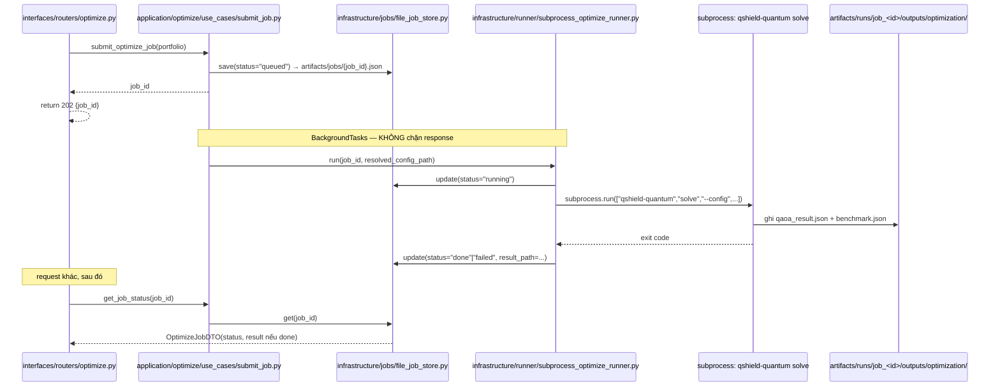

# Thiết kế `backend/` theo kiến trúc Clean/Hexagonal

**Trạng thái: THIẾT KẾ — chưa có file `.py` nào trong `backend/` được tạo theo tài liệu này.**
Owner: Đỗ Ngọc Tân. Chuyển từ `plan.md` sau khi thống nhất 3 quyết định mở ở bản nháp (job store
file-based, vị trí tài liệu, `mapper.py` chỉ nơi thật sự cần).

Tham khảo: `architecture.md` (kiến trúc Clean/Hexagonal mẫu, từ module `interview_calendar` của
một repo khác — chỉ dùng làm MẪU tổ chức thư mục, không copy nguyên nghiệp vụ). So khớp với thiết
kế hiện có: `docs/architecture/pipeline.md` §"`backend/` — FastAPI, chỉ đọc artifact" (7 router,
path/method giữ nguyên).

---

## 0. Điểm khác biệt cốt lõi so với `architecture.md` gốc

`domain/` của Q-SHIELD **không chứa công thức tài chính** — CVaR/QUBO/g-C-c đã sống trong
`packages/`, CLAUDE.md quy tắc 9 cấm lặp lại ở `backend/`. Nghiệp vụ của backend chỉ là **điều
phối**: gọi package nào, đọc artifact nào, trả DTO gì, và (riêng `optimize`) job nào đang chạy ở
đâu.

`modules/admin/{crud,routes,schemas,services,utils}` (kiến trúc CŨ ở một repo tham khảo khác) và
kiến trúc này chia nhỏ theo hai trục khác nhau — không phải cái này "kém chi tiết hơn":

| Trục cũ (`modules/*`) | Trục này (`domain/application/infrastructure/interfaces`) |
|---|---|
| `schemas/*.py` | `application/<feature>/dto.py` |
| `crud/*.py` | `infrastructure/persistence/<feature>_repository_impl.py` |
| `services/*.py` | `application/<feature>/use_cases/*.py` + `domain/<feature>/entities.py` |
| `routes/v1/*.py` | `interfaces/api/routers/<feature>.py` |
| `utils/*.py` | Không cần riêng — "tiện ích tính toán" đã nằm trong `packages/*` |

---

## 1. Bảy feature — mỗi feature đủ 4 lớp

### 1.1 `runs`

```
domain/runs/{entities.py, repository.py}      # RunSummary; Protocol RunRepository
application/runs/{dto.py, use_cases/{list_runs.py, get_run_detail.py}}
infrastructure/persistence/run_repository_impl.py   # đọc config.json/metrics.json/logs.txt qua ArtifactPaths
interfaces/api/routers/runs.py                        # GET /runs, GET /runs/{run_id}
```

### 1.2 `regime`

```
domain/regime/{entities.py, repository.py}    # RegimeSnapshot; Protocol RegimeRepository
application/regime/{dto.py, use_cases/{get_current_regime.py, get_regime_timeline.py}}
infrastructure/persistence/regime_repository_impl.py   # đọc regime_daily.parquet + regime_summary.json
interfaces/api/routers/regime.py                         # GET /regime/current, /regime/timeline
```

### 1.3 `scenarios`

```
domain/scenarios/{entities.py, repository.py}
application/scenarios/{dto.py, use_cases/get_scenario_summary.py}
infrastructure/persistence/scenario_repository_impl.py   # đọc scenario_manifest.json + validation.csv
interfaces/api/routers/scenarios.py                        # GET /scenarios/summary
```

### 1.4 `portfolio` — validate hình dạng, KHÔNG gọi package tài chính

```
domain/portfolio/entities.py     # PortfolioInput(weights, cash_weight) — tự validate tổng=1
application/portfolio/{dto.py, use_cases/validate_portfolio.py}   # check ticker ∈ universe.yaml
interfaces/api/routers/portfolio.py   # POST /portfolio/validate
```

Không có `infrastructure/` riêng — chỉ đọc `configs/universe.yaml` qua `qshield_contracts.config.
Config` (đã có sẵn).

**Quyết định (đã chốt, xem §6): KHÔNG chia sẻ `PortfolioInput` này với `risk`/`optimize`.** Ba
feature `portfolio`/`risk`/`optimize` đều nhận dữ liệu "danh mục" (`weights`+`cash_weight`) qua
API, nhưng mỗi feature khai entity RIÊNG (`domain/portfolio/entities.py::PortfolioInput`,
`domain/risk/entities.py::RiskPortfolioInput`, `domain/optimize/entities.py::OptimizeJobRequest`)
— cùng hình dạng field nhưng độc lập hoàn toàn, không import chéo giữa 3 `domain/<feature>/`. Lý
do: tránh một feature đổi entity của mình rồi vô tình phá 2 feature còn lại — đánh đổi là lặp field
3 lần, chấp nhận được vì chỉ 2 field (`weights`, `cash_weight`).

### 1.5 `risk` — gọi `qshield_risk` thẳng, đồng bộ (an toàn, xem §3)

```
domain/risk/entities.py     # RiskPortfolioInput(weights, cash_weight); BaselineRiskView — RIÊNG, không dùng chung domain/portfolio/
domain/risk/repository.py    # Protocol RiskCalculator
application/risk/{dto.py, mapper.py, use_cases/compute_cvar.py}   # mapper: RiskMetrics (dataclass) → DTO
infrastructure/calculation/qshield_risk_calculator.py   # implement RiskCalculator — import THẲNG qshield_risk.metrics
interfaces/api/routers/risk.py   # POST /risk/cvar
```

### 1.6 `optimize` — nặng nhất, job nền qua subprocess (xem §3, §4)

```
domain/optimize/entities.py
# OptimizeJobRequest(weights, cash_weight) — RIÊNG, không dùng chung domain/portfolio/ hay domain/risk/
# OptimizeJob(job_id, status, result, error, created_at, finished_at)
domain/optimize/repository.py    # Protocol OptimizeJobRepository — save/get/list
domain/optimize/runner.py         # Protocol OptimizeRunner — run(job_id, resolved_config_path) -> QaoaResultView  ← port quan trọng nhất
application/optimize/{dto.py, mapper.py, use_cases/{submit_job.py, get_job_status.py}}
infrastructure/
├── jobs/file_job_store.py                 # implement OptimizeJobRepository — xem §4
└── runner/subprocess_optimize_runner.py    # implement OptimizeRunner — BẮT BUỘC subprocess, xem §3
interfaces/api/routers/optimize.py   # POST /optimize/jobs → 202+job_id ; GET /optimize/jobs/{id}
```

### 1.7 `benchmark`

```
domain/benchmark/{entities.py, repository.py}
application/benchmark/{dto.py, use_cases/get_benchmark.py}
infrastructure/persistence/benchmark_repository_impl.py
interfaces/api/routers/benchmark.py    # GET /benchmark/quantum-vs-classical
```

### Helper dùng chung — không phải feature riêng

```
infrastructure/persistence/artifact_reader.py   # đọc parquet/json/csv qua ArtifactPaths — hàm tiện ích, KHÔNG phải Protocol; run/regime/scenario/benchmark repository_impl đều gọi hàm này
```

`mapper.py` **chỉ có ở `risk`/`optimize`** — hai nơi duy nhất có chuyển đổi hình dạng dữ liệu thật
(dataclass package, hoặc dict thô từ subprocess/stdout → DTO). `runs`/`regime`/`scenarios`/
`benchmark` đọc file gần như thẳng ra DTO, thêm `mapper.py` ở đó chỉ là pass-through vô nghĩa.

---

## 2. Cây thư mục tổng hợp

```
backend/src/qshield_api/
├── main.py
├── config.py
├── deps.py
├── domain/
│   ├── runs/{entities.py,repository.py}
│   ├── regime/{entities.py,repository.py}
│   ├── scenarios/{entities.py,repository.py}
│   ├── portfolio/entities.py                # PortfolioInput — riêng, không dùng chung với risk/optimize
│   ├── risk/{entities.py,repository.py}      # entities.py có RiskPortfolioInput riêng
│   ├── optimize/{entities.py,repository.py,runner.py}   # entities.py có OptimizeJobRequest riêng
│   └── benchmark/{entities.py,repository.py}
├── application/
│   ├── runs/{dto.py,use_cases/{list_runs.py,get_run_detail.py}}
│   ├── regime/{dto.py,use_cases/{get_current_regime.py,get_regime_timeline.py}}
│   ├── scenarios/{dto.py,use_cases/get_scenario_summary.py}
│   ├── portfolio/{dto.py,use_cases/validate_portfolio.py}
│   ├── risk/{dto.py,mapper.py,use_cases/compute_cvar.py}
│   ├── optimize/{dto.py,mapper.py,use_cases/{submit_job.py,get_job_status.py}}
│   └── benchmark/{dto.py,use_cases/get_benchmark.py}
├── infrastructure/
│   ├── persistence/
│   │   ├── artifact_reader.py
│   │   ├── run_repository_impl.py
│   │   ├── regime_repository_impl.py
│   │   ├── scenario_repository_impl.py
│   │   ├── benchmark_repository_impl.py
│   │   └── supabase_client.py               # giữ nguyên, KHÔNG đổi (OOS-013 — auth ngoài phạm vi)
│   ├── calculation/qshield_risk_calculator.py
│   ├── jobs/file_job_store.py
│   └── runner/subprocess_optimize_runner.py
└── interfaces/api/routers/
    ├── runs.py, regime.py, scenarios.py, portfolio.py,
    └── risk.py, optimize.py, benchmark.py
```

7 router — path, method, tên file **không đổi** so với `docs/architecture/pipeline.md` đã công bố.

---

## 3. Quyết định thiết kế quan trọng nhất — `OptimizeRunner` bắt buộc qua subprocess

`SubprocessOptimizeRunner` gọi `qshield-quantum solve` qua `subprocess.run`/
`asyncio.create_subprocess_exec` — **không bao giờ** `import qshield_quantum` trong tiến trình
`qshield_api`. Đã verify thật (không suy đoán, verify lại qua `notebooks/exploration/
quantum_solve.ipynb`): qiskit + pyarrow chung tiến trình sẽ segfault. FastAPI là một tiến trình
sống lâu, import mọi router lúc khởi động — lỗi này sập cả server, không chỉ một request.

Job chạy nền (`BackgroundTasks` hoặc `asyncio.to_thread`), vì `subprocess.run` chặn đồng bộ và tốn
70+ giây thật (đã đo: 71.9s cho 8-bit/10 seed).

`risk` KHÔNG cần ràng buộc này — không đụng qiskit, không ghi parquet, an toàn import thẳng, đồng
bộ, nhanh.

---

## 4. Thiết kế nơi lưu trữ job (`file_job_store.py`) — chi tiết

Hai vấn đề cần giải quyết, không chỉ "ghi ra file":

**a) Cô lập output giữa các job chạy song song.** `artifacts.mode: dev` (mặc định
`configs/base.yaml`) ghi vào đường dẫn CỐ ĐỊNH (`artifacts/dev/optimization/`) — nếu 2 job optimize
chạy gần nhau, job sau **đè** kết quả job trước trước khi job trước kịp đọc. Đây là vấn đề THẬT của
một backend đa-job, khác hẳn khi chạy 1 lệnh CLI đơn lẻ như các notebook đã làm.

**Giải pháp:** `SubprocessOptimizeRunner` luôn ép `ArtifactPaths` sang kiểu `runs`, dùng
**`run_id = f"job_{job_id}"`** — bất kể `configs/base.yaml` khai `mode: dev` hay `runs`:

```python
# infrastructure/runner/subprocess_optimize_runner.py — minh họa hình dạng, KHÔNG phải code thật
resolved_cfg = {**base_cfg, "artifacts": {**base_cfg["artifacts"], "mode": "runs"}}
paths = ArtifactPaths(resolved_cfg, run_id=f"job_{job_id}")
# → artifacts/runs/job_<job_id>/outputs/optimization/{qaoa_result.json,benchmark.json}
```

Mỗi job có thư mục riêng, không job nào đè job khác — dùng ĐÚNG cơ chế `ArtifactPaths` sẵn có
(CLAUDE.md quy tắc 8: đường dẫn artifact chỉ sinh từ đây), không phát minh cơ chế mới.

**b) Trạng thái job (`queued`/`running`) không phải là một "artifact pipeline".** `Stage` enum
(`qshield_contracts.enums.Stage`) chỉ có 6 giá trị cho 6 chặng khoa học/tài chính
(`data/regime/scenarios/risk/qubo/solve`) — job tracking là bookkeeping tầng API (vòng đời một
HTTP request), không phải artifact tài chính, và trạng thái `queued`/`running` phải tồn tại **trước
khi** `qshield-quantum solve` kịp ghi bất kỳ file nào trong `artifacts/runs/job_<id>/`. Vì vậy job
status **không** sống trong `Stage` nào — sống ở một vị trí backend tự quản, tách khỏi
`artifacts/dev|runs/`:

```
artifacts/jobs/{job_id}.json
```

(`artifacts/jobs/` là thư mục SIBLING với `artifacts/dev/` và `artifacts/runs/` — không nằm trong
`Stage` nào, không do `ArtifactPaths.stage_dir()` sinh ra, vì nó không phải artifact của một chặng
khoa học/tài chính, mà là bookkeeping của backend). Nội dung:

```json
{
  "job_id": "...",
  "status": "queued | running | done | failed",
  "created_at": "...",
  "finished_at": "... | null",
  "error": "... | null",
  "run_id": "job_<job_id>",
  "result_path": "artifacts/runs/job_<job_id>/outputs/optimization/qaoa_result.json"
}
```

`FileOptimizeJobRepository.get(job_id)` đọc file này để biết `status`; nếu `status == "done"`, đọc
thêm `result_path` (qua `artifact_reader.py` dùng chung) để trả `QaoaResultView` đầy đủ.

**Vòng đời ghi:** `submit_job` ghi `status=queued` NGAY (trước khi subprocess chạy) →
`SubprocessOptimizeRunner` cập nhật `status=running` lúc bắt đầu → `status=done`/`failed` lúc
subprocess kết thúc. Ba lần ghi, không phải một — khác artifact pipeline (chỉ ghi một lần lúc
xong).

**Đánh đổi đã chọn (ghi file, không in-memory):** sống sót qua restart backend — quan trọng vì job
optimize có thể chạy 70+ giây, backend có thể redeploy/restart giữa chừng lúc demo. Đổi lại: phải
tự dọn (`artifacts/jobs/*.json` cũ, `artifacts/runs/job_*/` cũ) — CHƯA thiết kế cơ chế dọn dẹp ở
đây, xem mục "Chưa quyết định" bên dưới.

---

## 5. Data flow — `POST /optimize/jobs`



---

## 6. Đã chốt (trước là "chưa quyết định")

1. **Dọn dẹp job cũ — chính sách theo NGÀY, CHƯA implement bây giờ.**
   `artifacts/jobs/*.json` và `artifacts/runs/job_*/` cũ hơn N ngày sẽ bị dọn — đúng con số N
   (vd. 7 ngày?) chưa chốt, để quyết sau. Hai đường triển khai dự kiến, **không làm ở bước thiết
   kế này**, chỉ ghi lại để không quên:
   - Script dọn tay (`scripts/cleanup_old_jobs.py`, chạy thủ công hoặc cron đơn giản).
   - Sau này chuyển sang Airflow (DAG lịch chạy hàng ngày) nếu cần vận hành lâu dài/tự động hơn.
   Bước "thiết kế nơi lưu trữ" ở §4 không đổi vì quyết định này — chỉ ảnh hưởng lúc có script/DAG
   dọn thật, không ảnh hưởng hình dạng `artifacts/jobs/{job_id}.json`/`artifacts/runs/job_*/`.
2. **`portfolio`/`risk`/`optimize` KHÔNG dùng chung `PortfolioInput`** — mỗi feature khai entity
   portfolio riêng trong `domain/<feature>/entities.py` (xem §1.4-1.6), tránh việc sửa 1 feature
   làm hỏng 2 feature còn lại.

## 7. KHÔNG nằm trong thiết kế này

- Không có file `.py` nào trong `backend/` được tạo — đây thuần là tài liệu thiết kế.
- Không đụng `supabase_client.py`/auth (giữ nguyên quyết định OOS-013).
- Không thiết kế cho `workflow_update` (20-bit, `rerank_polish`) — chờ `packages/` lên scope đó.
- Không có dữ liệu thật nào được ghi/push — `packages/data` (30 mã) và các phần khác của
  `workflow_update` chưa xong, thiết kế này chỉ mô tả NƠI dữ liệu sẽ nằm khi có, chưa tạo gì trên
  đĩa.
