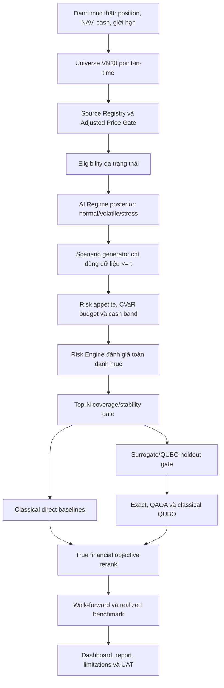

# NOVARIS/Q-SHIELD - Kế hoạch triển khai hợp nhất Workflow V2

**Mã tài liệu:** `QSHIELD-WF2-001`
**Phiên bản:** `1.0-draft`
**Ngày lập:** `2026-08-08`
**Product Owner:** Nguyễn Thị Ánh Ngọc
**Phạm vi:** Finance, Data, AI/Regime, Scenario, Risk, Optimization, Quantum, Benchmark, Backend,
Frontend và UAT
**Trạng thái:** `PROPOSED_CHANGESET` — nguồn tài liệu chính của team (`docs/workflow-v2.md`)
**Baseline code hiện tại:** `workflow_update` / `NON_BASELINE_RUN`
**Đối tượng sử dụng:** toàn bộ thành viên NOVARIS
**Disclaimer bắt buộc:** [`docs/disclaimer.md`](disclaimer.md)

---

## 1. Mục đích tài liệu

Tài liệu này hợp nhất các nhận xét audit, thay đổi, đề xuất và công việc cần thực hiện để đưa NOVARIS
từ một pipeline nghiên cứu đang chạy được sang một hệ thống hỗ trợ quyết định đầu tư:

1. dùng dữ liệu point-in-time có nguồn gốc và điều chỉnh giá đáng tin cậy;
2. nhận đúng danh mục thật, NAV, tiền mặt và giới hạn của người dùng;
3. biến risk appetite và mức stress thành risk budget/cash band có thể giải thích;
4. đánh giá tail-risk bằng CVaR/Expected Shortfall, chi phí và thanh khoản thực tế;
5. chọn top-N ứng viên có coverage và stability được đo lường;
6. chỉ đưa một bài toán tài chính hợp lệ sang QUBO/QAOA;
7. so sánh Quantum công bằng với exact và classical mạnh;
8. kiểm chứng recommendation bằng walk-forward/out-of-sample;
9. tạo report và UAT evidence đủ để Product Owner ký hoặc từ chối baseline.

Đây là **tài liệu SoT duy nhất** trong `docs/` (ngoài disclaimer). Config / code / report lấy số
policy từ đây và từ `configs/`; không duy trì Decision Package / PRD / checklist tách riêng.
---

## 2. Kết luận điều hành

### 2.1. Pain point sản phẩm được chốt lại

NOVARIS không giải quyết bài toán "nhà đầu tư thiếu Quantum". Pain point đúng là:

> Nhà đầu tư/cố vấn tại Việt Nam thiếu một quy trình dễ kiểm chứng để đưa danh mục thật vào hệ
> thống, nhận diện tail-risk theo trạng thái thị trường, rồi chuyển thành quyết định giảm mã nào,
> bao nhiêu, giữ bao nhiêu tiền mặt hoặc hedge thế nào sau khi tính chi phí, thanh khoản và khẩu vị
> rủi ro.

Quantum là một solver ứng viên phía sau. Quantum chỉ có đóng góp nếu tạo ra nghiệm khả thi, có chất
lượng tài chính và cạnh tranh được với baseline classical trên cùng bài toán.

### 2.2. Kết luận về hiện trạng

| Khu vực | Hiện trạng đã quan sát | Kết luận |
|---|---|---|
| Portfolio input | Frontend tạo equal-weight; optimize job chưa re-price toàn pipeline theo request | Chưa phải recommendation cá nhân hóa |
| Universe | 30 mã snapshot `2026-08-03`, dùng trên lịch sử từ 2016 | Hợp lệ cho live snapshot, không hợp lệ cho backtest point-in-time |
| Data | Yahoo/DNSE/vnstock còn provisional; adjusted-price chưa được sign-off toàn bộ | Data Gate chưa đủ cho baseline |
| Eligibility | 252 phiên, 98% coverage, turnover 20d >= 1 tỷ; rolling cho phép 10/20 phiên | Policy không nhất quán giữa tên metric và dữ liệu tối thiểu |
| Regime | Gaussian HMM 3 state | Hướng hợp lý; cần posterior calibration/stability và stress coverage |
| Scenario | 5.000 x 20 x 30; volatile PASS; stress bị skip; block reuse rất cao | Development evidence, chưa đủ robustness |
| Cash policy | Cố định tăng cash 10% | Đang chi phối nghiệm và không phản ánh risk appetite |
| Candidate | Risk chọn top 10 thật | Coverage khoảng 59-60%; chưa có stability artifact |
| Surrogate | 20 bit, đúng 211 fit samples cho 211 hệ số quadratic | Interpolation; chưa có independent holdout |
| Exact/classical | Cùng nghiệm all-ones; classical nhanh hơn exact đáng kể | Bài toán hiện tại dễ đối với classical |
| QAOA | Timeout, actual solver là exact | Chưa có đóng góp Quantum trong run hiện tại |
| CVaR result | Giảm tương đối khoảng 17,29% trên scenario cube | Chưa phải bằng chứng out-of-sample |
| UAT | Chưa có end-to-end input thật, reconciliation và investor report | Product Gate chưa pass |

### 2.3. Thứ tự triển khai bắt buộc

```text
Governance/Product Definition
        -> Point-in-time Data + Source Registry
        -> Real Portfolio Input
        -> Eligibility/Liquidity Policy
        -> AI Regime + Scenario Validation
        -> Risk Appetite + Risk Budget + Cash Band
        -> Risk Engine + Top-N Gate
        -> Strong Classical Baselines
        -> Surrogate/QUBO Holdout Gate
        -> Exact/QAOA/Classical Benchmark
        -> True-objective Rerank
        -> Walk-forward/Out-of-sample
        -> Dashboard Reconciliation + UAT + Report
```

Không đảo thứ tự bằng cách tối ưu QAOA trước khi các tầng đầu vào pass.

---

## 3. Quản trị thay đổi và hiệu lực

### 3.1. Các quyết định hiện hành bị ảnh hưởng

Workflow V2 đề xuất thay đổi các quyết định tạm thời trước đây (Decision Package TL-*):

| Change ID | Quyết định cũ | Đề xuất mới | Trạng thái |
|---|---|---|---|
| `CR-WF2-001` | `TL-004`: 252 phiên, coverage 98%, turnover >=1 tỷ | Eligibility đa trạng thái; 252 preferred/final, 126 minimum dev, coverage 95%, recent 18/20, liquidity theo capacity | Chờ Minh Anh đề xuất, Phúc/Ngọc duyệt |
| `CR-WF2-002` | `TL-009`: target tăng cash cố định 10% | Cash band + CVaR risk budget theo risk appetite và stress probability | Chờ Tú/Phúc cung cấp evidence, Ngọc duyệt |
| `CR-WF2-003` | Cash return bằng 0 trong Risk v1 | Cash instrument có yield, liquidity lag và source date; zero chỉ là sensitivity case | Chờ Phúc/Ngọc duyệt |
| `CR-WF2-004` | Universe snapshot cố định cho toàn pipeline | Live dùng snapshot as-of; historical test dùng membership history point-in-time | Chờ Minh Anh/Ngọc duyệt |
| `CR-WF2-005` | Top 10 luôn đi tiếp | Top-N phải qua coverage/stability gate; có thể mở rộng 12/15 hoặc fail có disclosure | Chờ Phúc/Ngọc duyệt |

### 3.2. Quy tắc hiệu lực

1. Trước khi change request được duyệt, run vẫn dùng Decision Package hiện hành và phải ghi đúng
   version.
2. Không sửa artifact cũ để làm như thể nó được sinh bởi policy mới.
3. Mỗi change request được duyệt phải cập nhật đồng thời config, requirements, acceptance criteria,
   RTM, schema, tests và report template.
4. Không đổi threshold sau khi nhìn final test result.
5. Run so sánh policy cũ/mới phải dùng cùng data version, portfolio, evaluation date, scenarios hoặc
   registered scenario seeds.

---

## 4. Chuẩn mực và nguyên tắc thiết kế

### 4.1. Finance

1. Dùng point-in-time data; cấm survivorship/look-ahead bias.
2. Return tính từ adjusted price đã có evidence; thanh khoản tính từ giá/khối lượng giao dịch thật.
3. CVaR/Expected Shortfall là tail-risk metric; không thay thế return, drawdown và chi phí.
4. Recommendation phải tính transaction fee, spread, liquidity/market impact và turnover.
5. Risk budget/cash band là policy của người dùng, không phải optimizer tự phát minh.
6. Không bỏ một position đang được người dùng nắm giữ khỏi phép tính risk chỉ vì position đó
   không đủ điều kiện giao dịch.
7. Mọi improvement claim phải được kiểm chứng sau chi phí và ngoài mẫu.

### 4.2. AI và statistical modeling

1. Train/validation/test phải có vai trò riêng; test không dùng để fit threshold hoặc scenario.
2. Regime phải được đánh giá về convergence, stability, occupancy, transition và ý nghĩa kinh tế.
3. Dùng posterior probability, không chỉ hard label.
4. Scenario validation phải kiểm tra moment, tail, correlation, autocorrelation và sample adequacy.
5. Tất cả threshold model phải được đăng ký trước final run.
6. Báo uncertainty/confidence interval; không chỉ báo point estimate.

### 4.3. Quantum/optimization

1. QAOA, exact và classical phải giải cùng QUBO hash và cùng constraint.
2. Exact-QUBO chỉ là optimum của surrogate QUBO, không mặc nhiên là optimum tài chính thật.
3. Surrogate phải có holdout độc lập; fit error gần zero không đủ.
4. QAOA phải chạy nhiều seed đăng ký trước, báo feasible rate, success probability, gap và runtime.
5. Warm-start từ exact không được dùng để chứng minh QAOA tự tìm optimum.
6. Không thêm constraint giả tạo chỉ để làm classical khó hơn.
7. Không tuyên bố quantum advantage khi chưa thắng baseline classical mạnh theo tiêu chí đăng ký
   trước.

### 4.4. Thị trường Việt Nam

1. Membership VN30 và lịch hiệu lực lấy từ nguồn chính thức HOSE/VNX.
2. Price limits, trading status, suspension, free-float và corporate action phải được lưu theo ngày.
3. Liquidity policy phải phù hợp quy mô lệnh của người dùng, không chỉ dùng một ngưỡng VND cố định.
4. Nếu dùng VN30 futures, phải tính multiplier, margin, mark-to-market, basis, expiry và rollover.
5. Không coi covered warrant, bond futures hoặc sản phẩm có thanh khoản thấp là hedge khả thi nếu
   chưa có executable price/liquidity evidence.

---

## 5. Flow hiện tại và Flow V2

### 5.1. Flow hiện tại

```text
30 ticker snapshot hiện tại
  -> data/adjusted returns
  -> HMM 3 state
  -> moving-block scenarios
  -> equal-weight portfolio
  -> Risk chọn top 10
  -> target tăng cash cố định 10%
  -> 4 action 0/10/20/30%, 20 bit
  -> fit QUBO bằng 211 samples
  -> exact/QAOA/classical
  -> QAOA timeout, fallback exact
  -> all-ones, bán 30% cả top 10
  -> cash gần 10%, CVaR scenario giảm 17,29%
```

### 5.2. Flow V2 đích



### 5.3. Thay đổi chính

| Tầng | Hiện tại | Workflow V2 |
|---|---|---|
| Input | Equal-weight mẫu | Portfolio/NAV/cash/restriction thật |
| Universe | Snapshot hiện tại áp lên quá khứ | Membership point-in-time cho backtest; snapshot cho live |
| Eligibility | Boolean | `MODEL_ELIGIBLE`, `LIMITED_HISTORY`, `TRADE_RESTRICTED`, `DATA_FAIL` |
| Liquidity | `close*volume`, threshold 1 tỷ | ADV/median value, participation rate, days-to-liquidate, spread |
| Regime | Hard label | Posterior probability + confidence |
| Cash | Tăng đúng 10% | Cash band + CVaR risk budget |
| Cash return | 0 | Versioned cash instrument/yield; zero là sensitivity case |
| Candidate | Top 10 cố định | Dynamic top-N sau coverage/stability gate |
| Action | 0/10/20/30 giống nhau mọi mã | 4 mức với per-asset cap; optional Gray encoding |
| Surrogate | 211 fit / 211 coefficient | Oversampled fit + independent holdout |
| Benchmark | Exact/classical; QAOA timeout | No-action/pro-rata/greedy/direct classical/exact/QAOA |
| Validation | Một evaluation date/cube | Multi-date, multi-regime walk-forward |
| Output | Development recommendation | Auditable decision-support report |

---

## 6. Workstream A - Product, persona và policy governance

**Owner:** Nguyễn Thị Ánh Ngọc
**Contributors:** Phúc, Tú, Tân
**Priority:** `P0`
**Stop condition:** chưa chốt persona/horizon thì không khóa cash/risk policy.

### 6.1. Việc cần làm

1. Chốt persona R1:
   - nhà đầu tư cá nhân có danh mục VN30;
   - cố vấn tài chính;
   - hoặc portfolio/risk analyst tổ chức nhỏ.
2. Chốt recommendation horizon: 20 phiên là mặc định hay user-selectable.
3. Chốt hệ thống là decision support, không phải auto-trading.
4. Chốt risk appetite questionnaire hoặc input trực tiếp:
   - maximum tolerable loss/drawdown;
   - CVaR budget;
   - liquidity need;
   - maximum turnover;
   - do-not-sell list;
   - minimum cash need.
5. Chốt các claim được phép và không được phép trong dashboard/report.
6. Tạo decision registry cho mọi threshold và policy version.

### 6.2. Output bắt buộc

- Persona / claim policy chốt trong §6;
- `configs/policies/risk_appetite.yaml`;
- `configs/policies/claim_policy.yaml`;
- biên bản duyệt `CR-WF2-*` (bảng §3.1).

### 6.3. PASS/FAIL

**PASS khi:** persona, horizon, input policy, claim policy và approver được ghi rõ.
**FAIL khi:** cùng một output vừa được gọi là "khuyến nghị đầu tư" vừa được coi là "demo kỹ thuật"
mà không có disclaimer/status.

### 6.4. Trade-off

- Persona hẹp giúp sản phẩm rõ và test được, nhưng giảm thị trường mục tiêu ban đầu.
- Questionnaire đơn giản tăng conversion nhưng có thể không đủ để suy ra risk budget.
- Cho người dùng nhập CVaR budget trực tiếp chính xác hơn nhưng khó hiểu với retail.

---

## 7. Workstream B - Point-in-time Data và Source Registry

**Owner:** Nguyễn Đỗ Minh Anh
**Approvers:** Minh Anh + Ngọc; Phúc duyệt tính dùng được cho Risk
**Priority:** `P0`
**Stop condition:** Data Gate fail thì downstream chỉ được `EXPERIMENTAL_NON_BASELINE`.

### 7.1. Universe point-in-time

Tạo membership history:

```text
ticker
index_family
effective_from
effective_to
announcement_date
source_url
source_hash
```

Quy tắc:

1. Live recommendation tại ngày `t` dùng đúng VN30 có hiệu lực tại `t`.
2. Backtest 2016-2026 dùng membership tại từng ngày, không dùng rổ 2026 xuyên lịch sử.
3. Freeze membership giữa hai ngày hiệu lực chính thức.
4. Lưu symbol change, exchange history, merger/delisting và corporate action.
5. Không retroactively loại một mã vì biết sau này nó bị loại khỏi VN30.

### 7.2. Price và return

1. Lưu riêng raw OHLCV, adjusted close và adjustment factor.
2. Return tính từ adjusted close đã verified.
3. Liquidity/traded value dùng raw traded price/volume hoặc official traded value.
4. Cấm `adjusted_close=close` nếu chưa có evidence.
5. Không forward-fill return.
6. Missing session được so với exchange calendar, không chỉ với ticker calendar.
7. Corporate action phải có evidence URL/file, event date, type và adjustment factor.

### 7.3. Source Registry

Mỗi dataset phải ghi:

```yaml
dataset_id: prices_vn30
vendor: yahoo|dnse|hose|other
retrieved_at: timestamp
coverage_from: date
coverage_to: date
fields: []
adjustment_policy: string
license_or_usage_note: string
raw_hash: sha256
processed_hash: sha256
owner: string
status: VERIFIED|PROVISIONAL|REJECTED
```

### 7.4. Output bắt buộc

- `universe_membership_history.parquet`;
- `universe_asof_<date>.csv`;
- `source_registry.json`;
- `prices_raw.parquet`;
- `prices_adjusted.parquet`;
- `returns.parquet`;
- `exchange_calendar.parquet`;
- `corporate_actions.parquet`;
- `adjusted_close_evidence_report.csv`;
- `data_quality_report.csv`;
- `data_manifest.json`.

### 7.5. PASS/FAIL

**PASS khi:** 100% ticker trong run có membership/source lineage; baseline không còn
`ADJ_UNVERIFIED`; không có PIT violation; các warning được disposition.
**FAIL khi:** dùng snapshot tương lai cho backtest, tự điều chỉnh outlier hoặc dùng close thay
adjusted close mà không disclosure.

### 7.6. Trade-off

- PIT universe tăng độ tin cậy nhưng làm panel thay đổi, phát sinh missing data và rebalance turnover.
- Cross-check nhiều nguồn tốn công và có thể gặp license/access limits.
- Dùng complete panel đơn giản hơn nhưng có thể tạo survivorship bias nghiêm trọng.

---

## 8. Workstream C - Eligibility và Liquidity V2

**Owner:** Minh Anh
**Financial reviewer:** Phúc
**Final approver:** Ngọc
**Priority:** `P0`

### 8.1. Phân biệt bốn khái niệm

1. **Official membership:** mã có thuộc VN30 tại ngày `t` hay không.
2. **Data eligibility:** dữ liệu có đủ và đáng tin để model hay không.
3. **Model eligibility:** model có thể ước lượng risk cho mã hay không.
4. **Trade eligibility:** có thể đề xuất giao dịch với quy mô portfolio hiện tại hay không.

Không dùng một cột boolean để đại diện cả bốn khái niệm.

### 8.2. Trạng thái đề xuất

| State | Điều kiện điển hình | Xử lý |
|---|---|---|
| `MODEL_ELIGIBLE` | Data/history/recent coverage đạt | Được rank và vào Quantum |
| `LIMITED_HISTORY` | Có 126-251 phiên hoặc regime coverage yếu | Vẫn tính risk bằng proxy/shrinkage; không baseline Quantum |
| `TRADE_RESTRICTED` | Đang giữ nhưng liquidity/status không đạt | Tính risk, không đề xuất trade hoặc giới hạn mạnh |
| `DATA_FAIL` | Price adjustment/source sai | Hard stop baseline |

### 8.3. Policy cân bằng đề xuất

```yaml
eligibility_v2:
  official_membership_required: true

  history:
    preferred_sessions: 252
    minimum_sessions_dev: 126
    limited_history_policy: conservative_proxy

  coverage:
    overall_min_pct: 0.95
    recent_window_sessions: 20
    recent_min_present: 18
    final_require_present: 20
    max_consecutive_missing: 2

  liquidity:
    adv_window_sessions: 20
    adv_fallback_window_sessions: 60
    max_participation_rate: 0.10
    max_days_to_liquidate: 1.0
    sensitivity_participation_rates: [0.05, 0.10, 0.15]

  baseline:
    require_preferred_history: true
    limited_history_allowed: false
```

Các con số trên là policy đề xuất để backtest, không phải chuẩn pháp lý của HOSE.

### 8.4. Công thức

```text
overall_coverage = observed_expected_sessions / expected_exchange_sessions
recent_coverage = observed_last_20 / 20
ADV20 = mean(raw_close * raw_volume, last 20 exchange sessions)
participation_rate = proposed_trade_value / ADV20
days_to_liquidate = proposed_trade_value / (ADV20 * max_participation_rate)
```

Nên bổ sung:

- median traded value 20/60 ngày;
- bid-ask spread nếu có;
- số phiên trần/sàn;
- stale-price rate;
- suspension/restriction flag;
- order-book depth hoặc market-impact proxy khi có nguồn.

### 8.5. Giải quyết mốc chốt dữ liệu 15/07/2026

**Nếu evaluation date là 15/07/2026 và dữ liệu có lịch sử trước đó:** có thể dùng 20 phiên kết thúc
tại 15/7; theo lịch ngày làm việc thông thường, cửa sổ bắt đầu khoảng 18/06/2026. Phải xác nhận lại
bằng exchange calendar thực tế.

**Nếu chỉ bắt đầu thu thập từ 15/07/2026:**

- đến 30/07 có khoảng 12 ngày làm việc;
- đến 07/08 có khoảng 18 ngày làm việc;
- ngày làm việc thứ 20 dự kiến 11/08 nếu không có ngày nghỉ giao dịch.

Current code dùng `rolling(20, min_periods=10)`, nên có thể sinh số sau 10 observation, nhưng phải
gắn `PARTIAL_WINDOW`; không được gọi đó là full 20-session liquidity.

Khuyến nghị vận hành: fetch tối thiểu 60 phiên trước evaluation date; final baseline yêu cầu recent
coverage 18/20 hoặc 20/20 theo policy đã duyệt.

### 8.6. Output bắt buộc

- `eligibility_daily.parquet` với state/reason code;
- `liquidity_daily.parquet`;
- `eligibility_policy_snapshot.yaml`;
- `eligibility_exceptions.csv`;
- `portfolio_trade_capacity.csv`;
- sensitivity report 5%/10%/15% ADV.

### 8.7. PASS/FAIL

**PASS khi:** mỗi position có model/trade status; mỗi exclusion có reason; partial window không bị
coi là full; trade capacity phụ thuộc NAV/lệnh.
**FAIL khi:** một position của người dùng biến mất khỏi risk calculation chỉ vì ineligible.

### 8.8. Trade-off

- Coverage 95% giữ nhiều mã hơn 98% nhưng tăng missing-data risk.
- 126 phiên hỗ trợ mã mới nhưng covariance/regime kém ổn định hơn 252 phiên.
- 18/20 thực dụng hơn 20/20 nhưng cần kiểm soát missing liên tiếp.
- Participation-rate phản ánh quy mô portfolio tốt hơn threshold 1 tỷ nhưng cần NAV/trade value.

---

## 9. Workstream D - Portfolio input và per-run lineage

**Owner:** Tân (API/UI/orchestration)
**Reviewer:** Phúc (financial calculation)
**UAT:** Ngọc
**Priority:** `P0`

### 9.1. Input contract

```yaml
portfolio:
  portfolio_id: string
  as_of_date: YYYY-MM-DD
  nav_vnd: number
  cash_vnd: number
  positions:
    - ticker: string
      quantity: number
      market_price: number|null
      average_cost: number|null
  restrictions:
    do_not_sell: []
    max_turnover_pct: number
    max_reduction_by_ticker: {}
    min_cash_pct: number|null
```

### 9.2. Quy tắc

1. Server reprice positions tại as-of date từ source đã duyệt.
2. Tổng stock market value + cash phải reconcile với NAV trong tolerance.
3. Unknown ticker, negative quantity, duplicate ticker và stale price phải báo lỗi rõ.
4. Request tạo `run_id` duy nhất trước stage đầu.
5. Mọi artifact downstream ghi portfolio hash, data hash, config hash và parent hashes.
6. Không đọc portfolio mẫu global khi đang chạy request của người dùng.

### 9.3. Output/PASS

- `portfolio_input.json`;
- `portfolio_valuation.json`;
- `portfolio_validation.json`;
- `run_manifest.json`.

**PASS khi:** đổi weights/cash/NAV làm baseline risk, candidate ranking và recommendation thay đổi
đúng; UI/API/artifact reconcile.
**FAIL khi:** API nhận weights nhưng job vẫn dùng handoff portfolio trên disk.

### 9.4. Trade-off

- Input position/quantity đúng thực tế hơn weights nhưng cần price timestamp và round-lot handling.
- Cho người dùng nhập market price nhanh hơn nhưng tạo pricing inconsistency.
- Reprice server-side đáng tin hơn nhưng phụ thuộc data availability.

---

## 10. Workstream E - AI Regime V2

**Owner:** Nguyễn Anh Tú
**Reviewers:** Phúc + Ngọc
**Priority:** `P0/P1`

### 10.1. Giữ và cải tiến 3 state

Ba trạng thái `normal`, `volatile`, `stress` được giữ làm champion ban đầu. Không coi số state là
đúng chỉ vì model converge.

### 10.2. Output posterior bắt buộc

```text
date
p_normal
p_volatile
p_stress
selected_regime
selection_confidence
model_version
```

### 10.3. Validation

1. Convergence và log-likelihood theo seed.
2. AIC/BIC trên candidate grid.
3. Regime occupancy và minimum observation count.
4. Transition matrix và dwell-time distribution.
5. Seed agreement/label alignment.
6. Economic profile: volatility, drawdown, correlation, liquidity theo regime.
7. Stability khi thêm dữ liệu mới.
8. Khả năng phân biệt future 20-day volatility/drawdown trên validation/walk-forward.
9. Drift report và refit trigger.

### 10.4. PASS/FAIL

**PASS khi:** mỗi state có đủ sample/economic profile, posterior ổn định, label mapping reproducible,
không có leakage.
**FAIL khi:** stress state rỗng hoặc chỉ xuất hiện vì một seed/khởi tạo.

### 10.5. Trade-off

- Posterior tốt hơn hard label cho policy nhưng cash band có thể thay đổi liên tục.
- Smoothing posterior giảm churn nhưng tạo độ trễ nhận diện stress.
- Nhiều state diễn tả thị trường tốt hơn nhưng giảm sample mỗi regime.

---

## 11. Workstream F - Scenario Engine V2

**Owner:** Tú
**Scenario Gate owner/reviewer:** Phúc
**Priority:** `P0/P1`

### 11.1. Split và point-in-time

1. Regime/model selection dùng train/validation.
2. Tại evaluation date `t`, scenario pool chỉ dùng dữ liệu `<=t`.
3. Outcome `t+1..t+20` chỉ dùng để backtest, không dùng sinh recommendation tại `t`.
4. Test period phải chạy nhiều rolling evaluation dates; không chọn ngày đẹp.

### 11.2. Scenario configurations

```yaml
development:
  num_scenarios: 2000
final:
  preferred_num_scenarios: 5000
sensitivity:
  num_scenarios: [2000, 5000]
  block_length: [3, 5, 10, 20]
  seeds: [101, 202, 303, 404, 505, 606, 707, 808, 909, 1001]
```

### 11.3. Validation metrics

- mean absolute difference;
- standard-deviation ratio;
- skewness difference;
- kurtosis difference;
- q05/q95 error;
- autocorrelation difference;
- cross-sectional correlation difference;
- tail coverage ratio;
- Wasserstein hoặc energy distance;
- unique block count/reuse rate;
- reference window count;
- bootstrap confidence intervals.

Tail sample count cần disclosure:

| S | CVaR 95% tail | CVaR 97,5% tail | CVaR 99% tail |
|---:|---:|---:|---:|
| 2.000 | 100 | 50 | 20 |
| 5.000 | 250 | 125 | 50 |

### 11.4. PASS/FAIL

**PASS khi:** target regime và stress regime có đủ reference; validation pass trên threshold đăng ký
trước; sensitivity không làm recommendation đảo vô lý.
**WARN khi:** small sample hoặc reuse cao nhưng analysis vẫn cần chạy.
**FAIL khi:** stress bị skip cho final, leakage, structural violation hoặc threshold quan trọng fail
mà không có approved exception.

### 11.5. Trade-off

- 5.000 scenario ổn hơn ở tail nhưng tăng runtime/memory.
- Block dài giữ autocorrelation tốt hơn nhưng giảm số unique blocks.
- Hard regime conditioning rõ nghĩa nhưng có thể thiếu sample; soft weighting tăng sample nhưng làm
  regime kém thuần.

---

## 12. Workstream G - Risk appetite, Risk Budget và Cash Policy V2

**Policy owner:** Ngọc
**Implementation owner:** Phúc
**AI input owner:** Tú
**Priority:** `P0`

### 12.1. Input policy

- risk appetite: conservative/balanced/aggressive hoặc custom;
- current cash;
- investment horizon;
- liquidity need;
- maximum turnover;
- maximum acceptable drawdown/loss;
- stress posterior;
- optional user cash floor/ceiling.

### 12.2. Output policy

```json
{
  "risk_appetite": "balanced",
  "p_stress": 0.42,
  "cash_min": 0.05,
  "cash_max": 0.10,
  "cvar_budget": 0.065,
  "max_turnover": 0.15,
  "policy_version": "cash-risk-policy-v1",
  "status": "PROVISIONAL_UAT"
}
```

### 12.3. Constraint và objective hierarchy

```text
Hard constraints:
  sum(stock_weights_after) + cash_after = 1
  cash_min <= cash_after <= cash_max
  no negative weights / no short stock
  do-not-sell respected
  per-asset reduction/liquidity cap respected
  turnover <= max_turnover

Risk constraint:
  CVaR_after <= risk_budget

Soft objectives, theo thứ tự:
  1. minimize risk-budget violation nếu policy infeasible
  2. minimize true CVaR
  3. minimize expected-return sacrifice
  4. minimize transaction cost/liquidity impact
  5. minimize unnecessary turnover/cash deviation
```

Nếu baseline portfolio đã thỏa risk budget và cash band, `no-action` phải hợp lệ. Nếu không có nghiệm
thỏa hard constraints, trả `INFEASIBLE_POLICY`; không tự nới policy âm thầm.

### 12.4. Mapping stress-to-cash

Ví dụ UAT, chưa phải threshold final:

| Risk appetite | Low stress | Medium stress | High stress |
|---|---|---|---|
| Aggressive | 0-3% | 2-5% | 5-10% |
| Balanced | 0-5% | 5-10% | 10-20% |
| Conservative | 5-10% | 10-20% | 20%+ hoặc hedge overlay |

Các band phải được calibration bằng historical walk-forward, feasibility và user testing. Nếu band
vượt khả năng stock-trim hiện tại, policy phải gọi defensive asset hoặc báo infeasible.

### 12.5. Cash return

Cash không mặc định luôn có return zero. Định nghĩa cash instrument:

```yaml
cash_instrument:
  type: idle_broker_cash|deposit|money_market_fund|futures_collateral
  annual_yield_net: number
  liquidity_lag_days: integer
  fee: number
  source: string
  source_date: date
```

```text
R_cash,H = exp(y_net * calendar_days / 365) - 1
```

Chạy sensitivity yield `0%/2%/4%/6%`. Zero vẫn được dùng làm conservative prototype case.

### 12.6. PASS/FAIL

**PASS khi:** policy có version/owner, no-action hợp lệ khi risk đã đủ, sensitivity được báo, cash
không bị ép đúng một điểm tùy ý.
**FAIL khi:** mọi portfolio đều phải tạo đúng 10% cash hoặc optimizer được thưởng vô hạn vì bán tối
đa.

### 12.7. Trade-off

- Cash band cá nhân hóa hơn nhưng tăng số nghiệm và độ phức tạp giải thích.
- Hard risk budget có ý nghĩa rõ nhưng có thể infeasible.
- Yield thực tế tăng realism nhưng cần định nghĩa cash instrument/source.

---

## 13. Workstream H - Risk Engine và Top-N Gate

**Owner:** Phúc
**Approver:** Ngọc
**Priority:** `P0/P1`

### 13.1. Risk calculation

Tính cho toàn portfolio:

- VaR/CVaR 95%, 97,5%, 99%;
- expected horizon return;
- worst scenario loss/drawdown;
- contribution to CVaR;
- marginal CVaR reduction theo action;
- transaction fee/spread;
- liquidity/market-impact penalty;
- turnover/cash generated;
- concentration theo sector/ticker;
- optional beta/factor exposure.

Ineligible position đang được nắm giữ vẫn nằm trong risk. Nếu model data yếu, dùng conservative
proxy/haircut có disclosure.

### 13.2. Candidate ranking

Ranking phải tách:

```text
gross_risk_benefit
- transaction_cost
- liquidity_impact
- constraint_penalty
= net_risk_score
```

Không chỉ rank bằng baseline CVaR contribution; phải kiểm tra marginal action benefit và interaction.

### 13.3. Coverage

```text
Coverage@N = sum(max(MRC_i, 0), i in TopN)
             / sum(max(MRC_i, 0), i in all eligible)
```

Báo ít nhất:

- baseline contribution coverage;
- marginal 10/20/30 coverage;
- net-benefit coverage;
- sector coverage.

### 13.4. Stability

- `Overlap@N = |A intersect B| / N`;
- Jaccard;
- Kendall tau/Spearman cho full rank;
- overlap qua scenario seeds;
- overlap qua block length/scenario count;
- overlap qua evaluation dates gần nhau.

### 13.5. Gate đề xuất

```yaml
candidate_gate_provisional:
  coverage_at_10_min: 0.70
  median_overlap_at_10_min: 0.70
  worst_overlap_at_10_min: 0.50
  on_fail:
    - evaluate_top12
    - evaluate_top15
    - warn_or_stop
```

Threshold phải được calibration và duyệt trước final test.

### 13.6. PASS/FAIL

**PASS khi:** coverage/stability đạt; order/hash reproducible; selected set không chứa data-fail hay
zero-weight.
**FAIL khi:** top 10 chỉ đại diện phần nhỏ risk nhưng vẫn đưa vào Quantum như thể đầy đủ.

### 13.7. Trade-off

- Top N lớn tăng coverage nhưng tăng bits/circuit/surrogate complexity.
- Top N nhỏ chạy nhanh nhưng có thể biến optimization thành quyết định cục bộ.
- Gate nghiêm làm nhiều run dừng; đổi lại tránh benchmark Quantum trên input không đại diện.

---

## 14. Workstream I - Action Grid và defensive assets

**Owners:** Phúc (finance), Tân (encoding/solver)
**Approver:** Ngọc
**Priority:** action grid `P1`; defensive assets `P2`

### 14.1. Stock action grid

R1 giữ 4 mức để giữ 2 bit/mã, nhưng cap theo tài sản:

```text
q_i_max = min(30%, liquidity_cap_i, user_cap_i, policy_cap_i)
grid_i = [0, q_i_max/3, 2*q_i_max/3, q_i_max]
```

Thêm:

- no-trade band;
- minimum lot/trade value;
- do-not-sell;
- zero-action lock trong polishing;
- per-asset final reduction bounds.

Benchmark current encoding và Gray encoding bằng holdout surrogate metrics, không chọn bằng cảm tính.

### 14.2. Defensive assets roadmap

Ưu tiên:

1. VN30 index futures cho beta hedge ngắn hạn;
2. idle cash/deposit/money-market instrument;
3. bond fund/TPCP nếu có duration/yield/liquidity data;
4. ETF cho diversification, không coi là market-beta hedge hoàn chỉnh;
5. covered warrant/bond futures chỉ sau executable-liquidity review.

### 14.3. Futures data

- price/OHLCV;
- bid-ask/spread;
- open interest;
- basis;
- daily settlement;
- expiry and roll calendar;
- contract multiplier;
- initial/maintenance margin theo ngày;
- trading/clearing fees;
- daily mark-to-market;
- collateral yield;
- portfolio beta/covariance;
- position limits.

### 14.4. Futures decision variables/constraints

```text
n_futures is integer
margin_required <= available_cash
position_limit respected
beta_after within target/tolerance
roll cost and basis risk included
daily margin-call stress passed
```

### 14.5. PASS/FAIL

**PASS khi:** action feasible theo lot/liquidity; futures P&L, margin và basis được scenario hóa; no
double-count cash/collateral.
**FAIL khi:** dùng notional futures như tiền mặt, bỏ margin call hoặc dùng sản phẩm không có liquidity.

### 14.6. Trade-off

- Adaptive grid thực tế hơn nhưng QUBO khác theo portfolio.
- Futures hedge nhanh và ít phải bán cổ phiếu nhưng có leverage, basis, margin và rollover risk.
- Thêm defensive assets tăng value tài chính nhưng mở rộng data/model/operational scope đáng kể.

---

## 15. Workstream J - Surrogate và QUBO Gate

**Owners:** Phúc (true objective/samples), Tân (fit/QUBO)
**Approver:** Ngọc cho threshold/product use
**Priority:** `P1`

### 15.1. Vấn đề phải sửa

Với 20 bit, quadratic model có:

```text
1 intercept + 20 linear + C(20,2) pairwise = 211 coefficients
```

Dùng đúng 211 fit samples có thể tạo full-rank interpolation và RSS gần zero nhưng không chứng minh
surrogate xếp hạng tốt trên 1.048.576 states.

### 15.2. Sampling mới

1. Giữ structured 211 samples để cover intercept/linear/pairwise.
2. Bổ sung random/stratified samples theo action count/cash/feasibility.
3. Tách train/validation/holdout bằng registered seed.
4. Holdout không dùng chọn coefficient/threshold.
5. Bổ sung samples quanh các nghiệm classical và policy boundaries.
6. Theo dõi duplicate và effective sample size.

### 15.3. Metrics

```text
MAE = mean(abs(J_hat - J_true))
RMSE = sqrt(mean((J_hat - J_true)^2))
NMAE = MAE / (P95(J_true) - P05(J_true))
Spearman = rank correlation(J_hat, J_true)
TopKRecall = |TopK_surrogate intersect TopK_true| / K
```

Không ưu tiên MAPE khi objective có thể gần zero hoặc phụ thuộc offset/scale.

Bổ sung:

- feasible precision/recall;
- ranking disagreement;
- regret của surrogate winner trên true objective;
- residual theo action count/cash bucket;
- stability across sample seeds.

### 15.4. PASS/FAIL

**PASS khi:** holdout độc lập đạt threshold đăng ký trước; top candidates không có material ranking
error; artifact lưu train/holdout hashes.
**FAIL khi:** chỉ báo fit RSS/MAE trên 211 samples rồi gọi QUBO là đúng.

### 15.5. Trade-off

- Nhiều true-objective samples tăng compute nhưng giảm surrogate model risk.
- Quadratic giữ QUBO đơn giản nhưng có thể không biểu diễn objective/constraints phức tạp.
- Higher-order/slack encoding tăng fidelity nhưng tăng bits, penalties và circuit depth.

---

## 16. Workstream K - Solver và Quantum benchmark

**Owner:** Tân
**Financial reviewer:** Phúc
**Product reviewer:** Ngọc
**Priority:** `P1/P2`

### 16.1. Baseline bắt buộc

1. `no_action`;
2. `pro_rata_cash_band`;
3. `greedy_marginal_cvar`;
4. `classical_direct_financial_objective`;
5. `exact_qubo`;
6. `classical_qubo`;
7. `qaoa_qubo`.

Mọi solver phải được true-objective rerank/chấm lại. QUBO energy không thay thế tài chính.

### 16.2. Fairness contract

- cùng portfolio/data/scenario/config;
- cùng `qubo_hash` cho QUBO solvers;
- cùng constraint/penalty;
- compute budget được công bố;
- reference CPU/RAM/OS/Python/Qiskit;
- timeout và fallback riêng;
- không cherry-pick seed;
- warm-start/no-warm-start là hai experiment khác nhau;
- simulator không đại diện QPU.

### 16.3. QAOA metrics

- best/median/worst energy;
- optimality gap;
- feasible rate;
- success probability;
- top-k probability mass;
- time-to-solution;
- per-seed/total runtime;
- shots, depth, optimizer iterations;
- circuit depth/two-qubit gate count;
- memory peak;
- timeout/failure rate;
- true CVaR/cost/turnover của output.

### 16.4. Claim rule

Không nói Quantum advantage trừ khi protocol đăng ký trước cho thấy QAOA:

1. đạt cùng/đủ chất lượng nghiệm trong time-to-solution tốt hơn baseline classical mạnh; hoặc
2. đạt true-objective tốt hơn trong cùng compute budget; và
3. kết quả ổn định qua nhiều instance/date/portfolio, không chỉ một run; và
4. có hardware/simulator caveat chính xác.

Nếu không đạt, đóng góp Quantum vẫn có thể được mô tả là:

- experimental candidate generator;
- nghiên cứu hybrid workflow;
- đánh giá khả năng encode bài toán;
- không tạo incremental decision value ở scope hiện tại.

### 16.5. PASS/FAIL

**PASS khi:** có output QAOA thật đủ seed/metric, không phải exact fallback; benchmark reproducible và
true-objective table đầy đủ.
**FAIL khi:** QAOA timeout nhưng dashboard hiển thị recommendation như Quantum output.

### 16.6. Trade-off

- Nhiều seed/shots tăng confidence nhưng tăng runtime.
- Circuit sâu tăng expressivity nhưng tăng simulation/noise cost.
- Strong classical baseline làm claim khó hơn nhưng là điều kiện bắt buộc để có uy tín.

---

## 17. Workstream L - Walk-forward, benchmark tài chính và UAT

**Owners:** Phúc (financial), Tú (regime/scenario), Tân (runner/UI), Ngọc (UAT/sign-off)
**Priority:** `P0/P1`

### 17.1. Walk-forward protocol

Với mỗi evaluation date `t`:

1. dựng universe/membership/eligibility chỉ từ thông tin có tại `t`;
2. fit/load model chỉ dùng dữ liệu được phép;
3. sinh scenarios chỉ dùng dữ liệu `<=t`;
4. nhận portfolio tại `t`;
5. tạo recommendation;
6. khóa recommendation trước khi nhìn tương lai;
7. quan sát realized returns `t+1..t+20`;
8. chấm after-cost P&L/risk cho NOVARIS và mọi baseline;
9. lặp qua nhiều ngày, regime, portfolio và data version;
10. tổng hợp confidence intervals và failure modes.

### 17.2. Metrics theo tầng

| Tầng | Metrics |
|---|---|
| Data | PIT violation, source coverage, adjustment reconciliation, stale/missing rate |
| Regime | AIC/BIC, convergence, seed agreement, occupancy, transition/dwell, drift |
| Scenario | moment/tail/correlation error, Wasserstein/energy, reuse, bootstrap CI |
| Risk forecast | VaR exceptions, Kupiec coverage, Christoffersen independence, ES backtest |
| Portfolio | realized CVaR, max drawdown, downside capture, return, Sharpe/Sortino, turnover/cost |
| Candidate | coverage@N, overlap/Jaccard, Kendall/Spearman stability |
| Surrogate | holdout MAE/RMSE/NMAE, Spearman, top-k recall, regret |
| Quantum | gap, feasible/success rate, TTS, depth/gates, memory |
| Product | latency, reconciliation, explanation completeness, UAT pass rate |

### 17.3. Benchmark interpretation

- Scenario CVaR reduction là ex-ante simulated evidence.
- Realized walk-forward loss/return là ex-post evidence.
- Một ngày giảm 17,29% trên scenario cube không chứng minh expected realized benefit.
- Phải báo return sacrifice và cost, không chỉ CVaR.
- Báo mean/median/dispersion/confidence interval và percentage of dates improved.

### 17.4. UAT cases tối thiểu

1. Balanced diversified portfolio.
2. Banking-concentrated portfolio.
3. High-volatility portfolio.
4. Portfolio đã có cash cao, nên no-action.
5. Do-not-sell constraint.
6. Ineligible/limited-history holding.
7. Low-liquidity trade capacity fail.
8. Cash-band infeasible.
9. QAOA timeout/fallback disclosure.
10. Scenario Gate fail/approved exception.

### 17.5. Final PASS

Baseline chỉ được ký khi:

1. Data Gate pass;
2. Regime/Scenario Gate pass hoặc exception được ghi rõ;
3. real portfolio chạy end-to-end;
4. cash/risk policy có version/sign-off;
5. top-N gate pass;
6. surrogate holdout pass;
7. benchmark có strong classical baselines;
8. solver identity trung thực;
9. walk-forward evidence đủ;
10. dashboard/artifact/report reconcile;
11. limitations/disclaimer đầy đủ;
12. Ngọc ký Product Gate/UAT.

### 17.6. Trade-off

- Walk-forward tốn compute và kéo dài delivery nhưng là bằng chứng đáng tin hơn một static run.
- Strict UAT có thể làm release chậm nhưng giảm rủi ro công bố sai.
- Báo uncertainty làm thông điệp ít "đẹp" hơn nhưng tăng uy tín.

---

## 18. Artifact và thư mục đích

```text
artifacts/
  <profile_id>/
    <run_id>/
      run_manifest.json
      config_snapshot.yaml
      portfolio/
        portfolio_input.json
        portfolio_valuation.json
        portfolio_validation.json
      data/
        data_manifest.json
        universe_asof.csv
        eligibility_snapshot.csv
        data_gate.json
      regime/
        regime_daily.parquet
        regime_summary.json
        regime_gate.json
      scenarios/
        scenarios.npz
        scenario_manifest.json
        scenario_validation.csv
        scenario_gate.json
      risk/
        baseline_risk.json
        candidate_order.json
        candidate_topn.csv
        candidate_gate.json
        risk_summary.json
      optimization/
        true_objective_samples.parquet
        surrogate_validation.json
        qubo_model.json
        exact_solution.json
        classical_results.json
        qaoa_results.json
        solver_benchmark.json
      recommendation/
        reranked_candidates.csv
        final_recommendation.json
        investor_report.json
      uat/
        dashboard_reconciliation.json
        limitations.json
        uat_evidence.json
```

Một run dùng một `run_id`. Mọi artifact ghi parent hashes; không trộn demo và workflow update.

---

## 19. Config migration đề xuất

### 19.1. Không sửa trực tiếp baseline ngay

Tạo profile thử nghiệm:

```text
configs/profiles/workflow_v2_experimental.yaml
configs/policies/eligibility_v2.yaml
configs/policies/risk_appetite.yaml
configs/policies/cash_instruments.yaml
```

Chỉ promote thành baseline sau change approval và test.

### 19.2. Config bắt buộc có status

```yaml
profile:
  id: workflow_v2_experimental
  status: PROPOSED_CHANGESET
  supersedes: null
  decision_package_version: string
  approved_by: []
```

### 19.3. Không hard-code rải rác

Các giá trị sau chỉ có một source of truth:

- data split/date range;
- eligibility/liquidity policy;
- scenario S/H/block/seeds;
- cash/risk appetite policy;
- costs/spread/liquidity impact;
- action grid/encoding;
- top-N gate;
- surrogate thresholds;
- solver settings/timeouts;
- materiality/claim rules.

---

## 20. Ma trận trách nhiệm RACI

| Workstream | Responsible | Accountable/Approver | Consulted | Informed |
|---|---|---|---|---|
| Product/persona/policy | Ngọc | Ngọc | Phúc, Tú, Tân | Team |
| Universe/source/data | Minh Anh | Minh Anh + Ngọc | Phúc | Team |
| Eligibility/liquidity | Minh Anh | Phúc + Ngọc | Tú, Tân | Team |
| Portfolio/API/lineage | Tân | Ngọc | Phúc | Team |
| Regime | Tú | Ngọc | Phúc | Team |
| Scenario | Tú | Phúc | Minh Anh, Ngọc | Team |
| Cash/risk objective | Phúc | Ngọc | Tú, Tân | Team |
| Candidate/top-N | Phúc | Ngọc | Tú, Tân | Team |
| Surrogate/QUBO | Tân + Phúc | Ngọc | Tú | Team |
| Solver/QAOA | Tân | Ngọc | Phúc | Team |
| Walk-forward | Phúc + Tú + Tân | Ngọc | Minh Anh | Team |
| Dashboard/report/UAT | Tân + Ngọc | Ngọc | All owners | Team |

---

## 21. Kế hoạch theo ưu tiên

### P0 - Phải hoàn thành trước mọi Quantum enhancement

- [ ] Chốt persona/horizon/claim policy.
- [ ] Duyệt change requests eligibility và cash policy.
- [ ] Point-in-time universe + source registry.
- [ ] Adjusted-price evidence và Data Gate.
- [ ] Real portfolio end-to-end, bỏ equal-weight hidden default.
- [ ] Eligibility/liquidity state + trade capacity.
- [ ] Regime posterior/stress coverage.
- [ ] Scenario point-in-time và gate robustness.
- [ ] Cash band + CVaR risk budget + no-action path.
- [ ] Strong investment baselines.
- [ ] Walk-forward protocol và evaluation dates đăng ký trước.

### P1 - Hoàn thiện optimization/Quantum evidence

- [ ] Top-N coverage/stability gate.
- [ ] Adaptive action grid benchmark.
- [ ] Oversampled surrogate + independent holdout.
- [ ] Exact/classical/QAOA same-instance benchmark.
- [ ] 10 seed QAOA, success/feasible/gap/TTS.
- [ ] True-objective rerank và report.
- [ ] Dashboard reconciliation/UAT.

### P2 - Mở rộng sản phẩm

- [ ] VN30 futures data/prototype.
- [ ] Integer hedge/margin/basis/roll scenarios.
- [ ] Cash-like instrument integration.
- [ ] Multi-asset risk factors.
- [ ] QPU experiment sau circuit resource audit.

---

## 22. Risk register

| Risk ID | Rủi ro | Tác động | Mitigation | Owner |
|---|---|---|---|---|
| `R-DAT-01` | Adjusted price sai | Return/CVaR sai | Cross-check, corporate action registry, hard gate | Minh Anh |
| `R-DAT-02` | Survivorship/PIT bias | Backtest quá đẹp | Membership history/as-of join | Minh Anh |
| `R-LIQ-01` | Liquidity threshold không theo NAV | Trade không thực thi được | Participation rate/days-to-liquidate | Phúc |
| `R-AI-01` | Regime không ổn định | Policy cash đảo liên tục | Posterior smoothing, stability/drift gate | Tú |
| `R-SCN-01` | Stress sample rỗng/reuse cao | Tail estimate không tin cậy | Pool redesign, weighting, sensitivity/disclosure | Tú/Phúc |
| `R-POL-01` | Cash target chi phối | All-ones/trivial decision | Cash band + risk budget + no-action | Phúc/Ngọc |
| `R-CAN-01` | Top 10 coverage thấp | Quantum giải sai scope | Coverage gate, dynamic top-N | Phúc |
| `R-SUR-01` | Surrogate interpolation | Exact-QUBO không tốt trên true objective | Independent holdout/rerank | Tân/Phúc |
| `R-QAO-01` | QAOA timeout/noise | Không có Quantum output | Budget, seed protocol, honest fallback | Tân |
| `R-BMK-01` | Baseline classical yếu | Quantum claim không uy tín | Direct classical/greedy/exact baselines | Tân/Phúc |
| `R-UAT-01` | UI/artifact lệch | Người dùng hiểu sai | Reconciliation tests, signed UAT | Tân/Ngọc |
| `R-DER-01` | Futures margin/basis | Hedge gây loss/margin call | Joint scenarios, margin stress, limits | Phúc/Tân |

---

## 23. Definition of Done cho Workflow V2

Workflow V2 chỉ được coi là hoàn thành khi toàn bộ điều kiện sau đúng:

1. Requirements/scope/workflow/config/RTM không còn conflict.
2. Change request có chữ ký owner/approver.
3. Data point-in-time và adjusted-price baseline pass.
4. Portfolio thật chạy end-to-end với lineage duy nhất.
5. Eligibility/liquidity phản ánh cả model quality và trade capacity.
6. Regime posterior và scenarios có validation/stability evidence.
7. Cash/risk policy có risk appetite, risk budget, band và no-action.
8. Top-N coverage/stability gate pass.
9. Surrogate independent holdout pass.
10. Exact, QAOA và classical được benchmark công bằng.
11. Solver output được chấm lại bằng true financial objective.
12. Walk-forward cho thấy value sau cost so với baseline, kèm confidence interval.
13. Dashboard, artifact và report reconcile.
14. Limitations/solver identity/data status được công bố trung thực.
15. Product Owner ký UAT và quyết định claim/release.

---

## 24. Quy tắc truyền thông trong team

Mỗi update/PR/report phải trả lời ngắn gọn:

1. Đây là profile/run nào?
2. Data/config/portfolio version nào?
3. Gate nào PASS/WARN/FAIL?
4. Solver được yêu cầu và solver thực tế là gì?
5. Metric là simulated, predicted hay realized?
6. So với baseline nào?
7. Limitation còn lại là gì?
8. Owner/reviewer nào đã duyệt?

Không sử dụng các câu sau nếu chưa có evidence:

- "Quantum tối ưu danh mục tốt hơn";
- "CVaR giảm 17,29% trên dữ liệu test";
- "Hệ thống phù hợp cho nhà đầu tư Việt Nam";
- "Top 10 đại diện phần lớn rủi ro";
- "Scenario phản ánh đầy đủ stress";
- "Recommendation đã được kiểm chứng".

Thay bằng mô tả đúng trạng thái, ví dụ:

> Development run trên scenario cube tại evaluation date X; requested solver QAOA timeout và actual
> solver exact; simulated CVaR giảm Y% so với no-action; chưa có walk-forward evidence.

---

## 25. Tài liệu tham chiếu bên ngoài

- HOSE Index Ground Rules: membership, liquidity/free-float và lịch review chỉ số.
- HNX/VSDC product specifications: VN30 futures multiplier, expiry, margin và market data.
- Basel market-risk framework: Expected Shortfall/CVaR và model validation context.
- Qiskit Finance portfolio optimization documentation: QUBO/QAOA formulation và simplifications.
- Peer-reviewed QAOA portfolio benchmarks: instance dependence, parameter/noise/benchmark limits.

Các nguồn bên ngoài phải được lưu URL, accessed date và version trong source/decision registry khi
dùng để khóa policy hoặc claim.

---

## 26. Quyết định tiếp theo cần Ngọc chủ trì

1. Mở review `CR-WF2-001` cho Eligibility/Liquidity V2.
2. Mở review `CR-WF2-002` cho Cash Band + CVaR Risk Budget.
3. Yêu cầu Minh Anh xác nhận dữ liệu chốt 15/7 có lịch sử tối thiểu từ 18/6 và tốt nhất 60 phiên
   trước đó.
4. Yêu cầu Tú cung cấp posterior/stress coverage và scenario point-in-time protocol.
5. Yêu cầu Phúc cung cấp direct classical/no-action/pro-rata/greedy benchmark specification.
6. Yêu cầu Tân loại equal-weight hidden path khỏi optimize production flow và tạo per-run lineage.
7. Chỉ sau P0 mới duyệt work item tăng depth/shots/qubits hoặc thêm QPU.

**Trạng thái cuối của tài liệu:** `PROPOSED_CHANGESET / TEAM_REVIEW_REQUIRED`.
