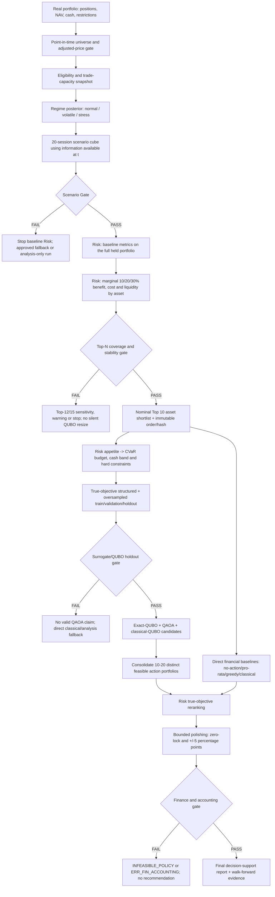

# Q-SHIELD Risk Workflow — Implementation Flow and Delivery Plan

**Document ID:** `QSHIELD-RISK-IMPL-FLOW-001`  
**Version:** `0.1-draft`  
**Last updated:** `2026-08-13`  
**Owner:** Liêu Hoài Phúc (Risk)  
**Status:** `IMPLEMENTATION_COMPANION` / `NON_BASELINE_RUN`  
**Code baseline:** `origin/main@97ceb0b`  
**Product source of truth:** [`docs/workflow-v2.md`](../../docs/workflow-v2.md)

## 1. Purpose and authority

This document turns the approved direction and proposed Workflow V2 changes into an
implementation-ready flow for `packages/risk/`. It does not create a second Product source of
truth and does not approve policy values. If this document conflicts with
`docs/workflow-v2.md`, the latter wins.

The following external baseline-candidate documents were used as requirement inputs:

- `QSHIELD-PSS-001` — Product Scope Statement v1.0;
- `QSHIELD-PRS-001` — Product Requirements Specification v1.0;
- `QSHIELD-US-001` — User Stories and Product Backlog v1.0;
- `QSHIELD-AC-001` — Acceptance Criteria v1.0;
- `QSHIELD-RISK-WORKFLOW-001` — Risk Engine and Current Workflow v0.1.

Those documents currently remain `Baseline Candidate` or `Working Draft`. Repository
implementation therefore uses the `workflow_update` profile and must keep the
`NON_BASELINE_RUN` disclosure until the required change requests and gates are signed.

## 2. Scope boundary

### 2.1 In scope for Risk

- Evaluate the complete user portfolio on a validated 20-session scenario cube.
- Calculate VaR/CVaR at 95%, 97.5% and 99%, expected horizon return and path drawdown.
- Apply one pre-horizon stock reduction and reconcile stocks, cash, costs and NAV.
- Evaluate transaction cost, turnover, liquidity impact and policy constraints.
- Own the canonical `financial_objective()` used by sampling, reranking and polishing.
- Rank held/trade-eligible assets and operate the Top-N coverage/stability gate.
- Produce true-objective samples for the QUBO surrogate.
- Re-evaluate solver candidates using the true financial objective.
- Polish active reductions within the approved local bounds and produce final accounting.
- Produce risk, candidate, reranking, benchmark and recommendation artifacts with provenance.

### 2.2 Out of scope for Risk

- Source raw market data or decide corporate-action adjustments.
- Train or relabel the regime model.
- Generate scenario paths or override a failed Scenario Gate.
- Fit QUBO coefficients, operate QAOA or claim quantum advantage.
- Put orders into a broker, promise loss reduction or promise future performance.
- Silently approve policy thresholds, relax constraints or replace missing upstream artifacts.

### 2.3 Legacy compatibility boundary

`qshield_risk.evaluate()` and the 8-asset/K=3/20%-binary path remain compatibility APIs for Risk
v1. They are not the Workflow V2 decision path. Workflow V2 uses dynamic Top-N, four action levels,
`financial_objective()`, true reranking and local polishing. New code must not mix the two contracts
inside one artifact or label a legacy run as a Workflow V2 baseline.

## 3. Correct end-to-end interpretation



There are two different shortlists:

1. **Asset shortlist:** the point-in-time VN30 universe contains up to 30 names; Risk evaluates the
   complete held portfolio, ranks held/trade-eligible names and normally selects 10 assets for the
   20-bit QUBO instance after the Top-N gate passes.
2. **Action-portfolio shortlist:** solvers produce combinations of reductions across those assets;
   Risk consolidates and truly evaluates 10–20 distinct feasible portfolios.

“Top 3” may be a presentation choice for the first three final action portfolios. It is not the
current asset-selection policy and must not be confused with the legacy `K=3` constraint.

## 4. Decision timeline and no-leakage invariant

For an evaluation timestamp `t`:

1. Universe membership, prices, adjustment factors, trading status, restrictions, portfolio and
   all policy inputs must be known as of `t`.
2. Regime features and posterior may use observations available no later than `t`.
3. Scenario fitting/conditioning may use only the registered train/validation history available at
   `t`; final test observations must not calibrate thresholds or policy.
4. The hedge action is modeled as one rebalance before the first scenario step.
5. The portfolio is buy-and-hold over the 20-session horizon unless a future approved policy states
   otherwise; there is no hidden daily rebalancing.
6. Walk-forward realized evaluation begins after `t` and uses the same execution timing and cost
   convention as the strategy and its benchmarks.

Any point-in-time or split violation changes the run to a failed or explicitly analysis-only state.
It must not create downstream QUBO or final recommendation artifacts that look valid.

## 5. Canonical financial invariants

### 5.1 Return, wealth and loss

- Scenario input is simple daily return, validated finite and greater than `-1`.
- Portfolio risk return must come from verified adjusted prices upstream; liquidity must use raw
  traded prices/volumes or approved official traded value.
- Asset growth is `G[s,t,i] = product(1 + r[s,u,i], u=0..t)`.
- Portfolio wealth uses stock and cash **amounts**, not normalized post-cost weights.
- Terminal simple return is `R[s] = W[s,H-1] / NAV_before - 1`.
- Loss is always `L[s] = -R[s]`; positive loss means economic loss.
- Maximum drawdown is calculated from wealth versus its running peak, including initial NAV.

### 5.2 VaR and CVaR

- CVaR 95% is the primary risk component.
- VaR/CVaR 97.5% and 99% are robustness outputs, not alternative optimization targets by default.
- The current empirical implementation includes all losses tied at VaR in the tail and reports the
  actual tail count.
- Before baseline promotion, the empirical quantile interpolation/tie convention must be registered
  and reconciled with the approved Financial Objective Specification.
- CVaR 99% must include uncertainty information and a low-tail stability warning; it must not be
  presented as a precise point estimate when effective tail observations are small.

### 5.3 Action and accounting

For asset `i`, reduction `d_i` is a fraction of its current position, not percentage points of NAV:

```text
gross_sale_i = current_stock_amount_i * d_i
stock_amount_after_i = current_stock_amount_i - gross_sale_i
NAV_after = NAV_before - cash_transaction_cost
cash_amount_after = cash_before + sum(gross_sale_i) - cash_transaction_cost
```

The required reconciliation is:

```text
sum(stock_amount_after) + cash_amount_after = NAV_after
sum(normalized_stock_weights_after) + normalized_cash_weight_after = 1
```

Current TL-008 accounting treats fee and spread as cash transaction costs and keeps liquidity impact
as a separate objective component. If sell tax or a richer market-impact model is approved, it must
be added through a versioned contract/config and regression tests; it must not be hidden inside an
unrelated component.

### 5.4 Objective and feasibility

The canonical minimization objective remains auditable by component:

```text
J(d) = w_cvar * scaled_CVaR95(d)
     + w_return * scaled_return_sacrifice(d)
     + w_cost * scaled_transaction_cost(d)
     + w_turnover * scaled_turnover(d)
     + w_liquidity * scaled_liquidity_impact(d)
     + w_cash * scaled_cash_band_deviation(d)
```

Every component returns raw value, scale, weight and weighted contribution. Hard/risk constraint
violations are returned separately and are never hidden only inside `J(d)`.

Required constraints include, when present in the approved policy:

- weight and NAV reconciliation;
- no short/no negative weight/no sale beyond current position;
- cash floor and ceiling;
- maximum turnover;
- do-not-sell list;
- per-asset user, policy and liquidity caps;
- minimum lot/trade value;
- `CVaR_after <= cvar_budget`.

If no feasible candidate exists, return `INFEASIBLE_POLICY`. Do not silently relax policy. If the
baseline portfolio is already within budget and cash band, no-action must remain feasible.

## 6. Regime, risk policy and transition behavior

Risk does not select a different formula for each hard regime label. Regime posterior affects the
scenario distribution and the approved risk/cash policy. The canonical accounting and CVaR math stay
the same across regimes, which keeps results comparable and auditable.

To avoid abrupt portfolio changes near regime boundaries:

- consume posterior probabilities rather than only a hard label;
- map posterior and risk appetite to a versioned CVaR budget and cash **band**, not a fixed cash
  point;
- apply any approved posterior smoothing/hysteresis upstream or in the policy layer;
- enforce maximum turnover, per-asset caps and no-trade bands;
- preserve no-action when risk remains within policy;
- report policy version and pre/post-policy values in every run.

Smoothing must not use future observations. Transition parameters must be calibrated on
train/validation and frozen before final walk-forward evaluation.

## 7. Top-N asset gate

### 7.1 Ranking inputs

For every held/model-eligible asset, compute on common scenarios:

- baseline CVaR contribution;
- marginal CVaR reduction at 10%, 20% and 30%;
- transaction cost estimate;
- liquidity/market-impact estimate;
- constraint eligibility and per-asset cap;
- net risk score with separate, traceable components.

Held but trade-restricted positions remain in full-portfolio risk. They may be excluded from the
trade candidate set only with an explicit reason and conservative treatment where model data is
weak.

### 7.2 Coverage and stability

At minimum, produce:

- baseline-contribution coverage;
- marginal 10/20/30% coverage;
- net-benefit coverage;
- sector coverage;
- overlap/Jaccard across scenario seeds, block lengths and nearby dates;
- rank correlation for the complete eligible ranking.

The provisional Workflow V2 gate is `coverage@10 >= 0.70`, median overlap@10 `>= 0.70` and worst
overlap@10 `>= 0.50`. These are calibration candidates, not approved production facts.

On gate failure, evaluate Top-12/Top-15 sensitivity and either warn or stop according to policy.
Do not pad fake assets, silently change the 20-bit instance or claim the Top 10 represents full
portfolio risk.

## 8. Quantum handoff and final selection

### 8.1 Baseline encoding

- Nominal candidate count: 10.
- Two bits per candidate, 20 decision bits total.
- Mapping: `00 -> 0%`, `10 -> 10%`, `01 -> 20%`, `11 -> 30%` of current position.
- Per-asset cap may shrink the economic grid only after an approved contract defines how encoding
  and decoding represent the adaptive levels.
- Candidate order and its hash are immutable from sampling through all solvers and reranking.

### 8.2 Objective samples

Keep the 211 structured evaluations for intercept, 20 main effects and 190 pairwise effects, then:

1. add random/stratified samples across action count, cash bucket and feasibility;
2. add boundary and direct-classical-neighborhood samples;
3. split fit/validation/holdout with registered seeds;
4. prevent accidental overlap except deliberate reference cases;
5. store true objective components, violations, policy/config hashes and sample provenance.

The QUBO gate uses independent holdout MAE/RMSE/NMAE, Spearman, Top-K recall, feasibility metrics,
winner regret and seed stability. Near-zero fit error on the 211 design points is not sufficient.

### 8.3 Reranking and polishing

- Consolidate distinct feasible bitstrings from exact, QAOA and classical solver outputs.
- Preserve solver provenance, energy, probability/count, hashes and fallback status.
- True-evaluate 10–20 candidate portfolios with the canonical Risk objective.
- Select by feasible true objective, with declared tie-breaks; never select by QUBO energy alone.
- Polish only non-zero Quantum actions by at most `+/-5` percentage points and within final caps.
- Keep every Quantum zero at zero.
- Report improvement due to coarse solver action separately from polishing improvement.
- Compare with no-action, pro-rata, greedy and direct-classical financial baselines.

The winner is best within the evaluated candidate/policy/scenario set. It is not automatically a
global optimum of the true financial objective and is not evidence of out-of-sample improvement.

## 9. Contracts and artifacts

### 9.1 Required inputs

| Input | Required content | Gate behavior |
|---|---|---|
| Portfolio | `run_id`, evaluation time, NAV, positions/weights, cash, restrictions | Reject invalid totals; no hidden equal-weight fallback |
| Data | as-of universe, source/adjustment lineage, eligibility/trade capacity | `DATA_FAIL` blocks baseline |
| Regime | posterior probabilities, model/version/hash, as-of timestamp | Missing/stale posterior blocks policy baseline |
| Scenario | cube `[S,20,N]`, ticker order, seed/block/config, gate verdict | Shape/order/non-finite/gate failure blocks Risk |
| Policy | risk appetite, cash band, CVaR budget, turnover/caps, version/owner/status | Missing critical policy yields non-baseline or fail |
| Cost/liquidity | explicit versioned rates/model, source and units | No production defaults inside math functions |

### 9.2 Risk-owned outputs

```text
artifacts/<profile_id>/<run_id>/
  risk/
    baseline_risk.json
    candidate_topn.csv
    candidate_order.json
    candidate_gate.json
    risk_summary.json
  optimization/
    true_objective_samples.parquet
  recommendation/
    reranked_candidates.csv
    final_recommendation.json
  benchmark/
    true_benchmark.json
```

All outputs include schema version, producer, run/profile ID, input parent hashes, config/policy
version and status. Canonical outputs are written only after validation succeeds; a failed run must
not leave stale artifacts that appear current.

## 10. Current implementation assessment

| Area | Current state on `origin/main@97ceb0b` | Required next state |
|---|---|---|
| Wealth/metrics | Simple-return compounding, buy-and-hold, CVaR/tail count and drawdown implemented | Register tail convention; add CVaR 99% CI/stability evidence |
| Accounting | Generic per-asset reductions and post-cost reconciliation implemented | Correct stale liquidity wording; add approved tax/impact model if selected |
| Objective | Composite `financial_objective()` with raw/scaled/weighted components implemented | Implement policy constraints and cash band/risk budget; remove fixed-target dependence |
| Candidate ranking | Four-level marginal metrics and deterministic Top-N implemented | Consume real eligibility; add multi-coverage and cross-seed/date stability gate |
| Sampling | Exactly structured quadratic design implemented | Oversample and create independent validation/holdout datasets |
| Rerank/polish | True reranking, zero-lock and +/-5pp polishing implemented | Reject/inform infeasible policy; add complete provenance and direct baselines |
| Legacy API | 8-bit/K=3 evaluator remains public | Mark compatibility explicitly; keep out of Workflow V2 artifacts |
| Docs | Package `RISK_ENGINE.md` still describes Risk v1 | Reconcile after the implementation phases below, without rewriting Product SoT |

## 11. Delivery plan

### Phase 0 — Governance freeze and contracts (`P0`, blocking)

1. Obtain decisions for `CR-WF2-002` cash/risk policy and `CR-WF2-005` Top-N gate.
2. Register the empirical CVaR convention, cost components, cash instrument and objective scales.
3. Finalize portfolio, eligibility, regime/scenario and policy input schemas with the relevant
   owners; Risk does not modify shared boundaries unilaterally.
4. Add profile status and explicit fallback/analysis-only states.

**Exit:** policy/schema versions exist, owners/approvers are recorded and missing critical fields
fail deterministically.

### Phase 1 — Risk core hardening (`P0`)

1. Add CVaR 99% uncertainty and effective-tail stability warning.
2. Reconcile cost terminology and implement approved fee/tax/spread/impact components.
3. Add hand-calculated regression tests for every metric and accounting convention.
4. Add property tests for finite outputs, ticker permutation, weight conservation and monotonic
   action/accounting boundaries.

**Exit:** `AC-RSK-001..015` and `AC-FIN-010..014` have test evidence or an explicit approved
deviation.

### Phase 2 — Policy and constraints (`P0`)

1. Implement a versioned risk-policy object: cash band, CVaR budget, turnover, do-not-sell,
   per-asset/liquidity caps and no-action behavior.
2. Replace fixed target-cash dependence in the Workflow V2 path.
3. Return structured violations separately from objective components.
4. Implement `INFEASIBLE_POLICY` with no silent relaxation.
5. Add transition-smoothing inputs only after policy approval and leakage-safe calibration.

**Exit:** no-action, feasible hedge and intentionally infeasible fixtures all reconcile with
expected status and explanation.

### Phase 3 — Top-N coverage/stability gate (`P0/P1`)

1. Consume upstream eligibility/trade-capacity artifacts instead of inferring eligibility from
   positive weight.
2. Calculate all required coverage variants and stability statistics.
3. Produce `candidate_gate.json` with PASS/FAIL/WARN, threshold version and sensitivity results.
4. Keep the 20-bit baseline fixed; Top-12/15 runs are separately identified sensitivity/design
   runs unless an approved Quantum contract supports them.

**Exit:** `AC-CAN-001..012` pass and the selected order/hash is reproducible.

### Phase 4 — Objective sampling and handoff (`P1`, joint Phúc/Tân)

1. Extend the sampler beyond the 211 structured points.
2. Create registered fit/validation/holdout manifests and prevent sample leakage.
3. Provide true objective, components, violations and hashes for every sample.
4. Agree adaptive-grid and variable-N behavior before encoding changes.
5. Tân owns QUBO fit/solver artifacts; Phúc owns correctness of true financial labels.

**Exit:** `AC-QUB-001..015` pass, especially independent holdout and same-hash requirements.

### Phase 5 — True reranking, polishing and benchmark (`P1`)

1. Enforce all policy constraints during true reranking and polishing.
2. Add direct financial baselines and compare on the same portfolio/scenarios/costs.
3. Produce top 10–20 true candidates; dashboard may display the first three without redefining
   asset Top-N.
4. Add materiality and honest no-improvement/fallback labels.
5. Reconcile final portfolio, NAV, cash, weights, costs and provenance.

**Exit:** `AC-FIN-001..015` pass; final output never depends only on surrogate energy.

### Phase 6 — Walk-forward and release evidence (`P0/P1`, joint team)

1. Register evaluation dates across normal/volatile/stress regimes.
2. Freeze train/validation policies before opening each test window.
3. Backtest VaR exceptions/ES quality, candidate stability and realized post-cost outcomes.
4. Reconcile artifacts with backend/dashboard and sign UAT limitations.
5. Promote from `NON_BASELINE_RUN` only after Data, Scenario, Risk, Candidate, QUBO, Finance and
   Product gates pass.

**Exit:** reproducible run bundle, signed gate evidence and no unsupported recommendation or
quantum-advantage claim.

## 12. Test and verification matrix

| Layer | Minimum verification |
|---|---|
| Metrics | Hand-computed VaR/CVaR at 95/97.5/99, ties, tail count, CI/stability, invalid values |
| Timeline | as-of timestamps, split boundaries, no future regime/scenario/policy information |
| Portfolio | ticker-order permutation, no auto-normalization, amount/weight/NAV reconciliation |
| Costs | fee/tax/spread/impact basis, low/base/high sensitivity, no double counting |
| Constraints | cash band, risk budget, turnover, do-not-sell, per-asset cap, infeasible policy |
| Candidate | deterministic ties, eligibility reasons, coverage variants, seed/date stability |
| Sampling | unique structured points, oversampling, no split overlap, deterministic hashes |
| Rerank | true objective ordering, feasibility, tie-break, provenance, materiality |
| Polishing | zero-lock, +/-5pp, caps, no objective/constraint divergence |
| Integration | scenario/data gate failures, underfill, stale artifact cleanup, full handoff |
| Research | walk-forward, uncertainty, strong classical baselines, honest claim labels |

Required package verification after each implementation slice:

```text
uv run pytest packages/risk -q
uv run pytest packages/contracts/tests -q
uv run ruff check packages/risk
uv run mypy packages/risk/src/qshield_risk
```

## 13. Traceability anchors

| Flow area | External requirement anchors | Repository anchor |
|---|---|---|
| Baseline metrics | `PR-RSK-001..008`, `AC-RSK-001..007` | Workflow V2 §13.1 |
| Cost/objective | `PR-RSK-009..020`, `AC-RSK-008..015` | Workflow V2 §12–13 |
| Candidate gate | `PR-CAN-001..015`, `AC-CAN-001..012` | Workflow V2 §13.2–13.6 |
| QUBO handoff | `PR-QUB-001..017`, `AC-QUB-001..015` | Workflow V2 §14–15 |
| Rerank/accounting | `PR-FIN-001..018`, `AC-FIN-001..015` | Workflow V2 §16–17 |
| Artifacts/governance | `AC-GOV-*`, `AC-NFR-*` | Workflow V2 §18–22 |

## 14. Blocking decisions and safe defaults

The following are blockers for baseline promotion, not invitations to hard-code assumptions:

- approved cash/risk policy and posterior-to-policy mapping;
- cash instrument/yield and liquidity lag;
- sell tax, spread and market-impact model;
- CVaR quantile/tail and 99% uncertainty convention;
- objective weights/scales and materiality threshold;
- Top-N coverage/stability thresholds and failure action;
- per-asset cap, minimum trade and do-not-sell schema;
- oversampling volume, registered seeds and surrogate holdout thresholds;
- walk-forward dates and final claim policy.

Development fixtures may use explicit versioned numbers, but every output must state
`NON_BASELINE_RUN`/`PROVISIONAL` and must not be presented as investment advice or production
evidence.
